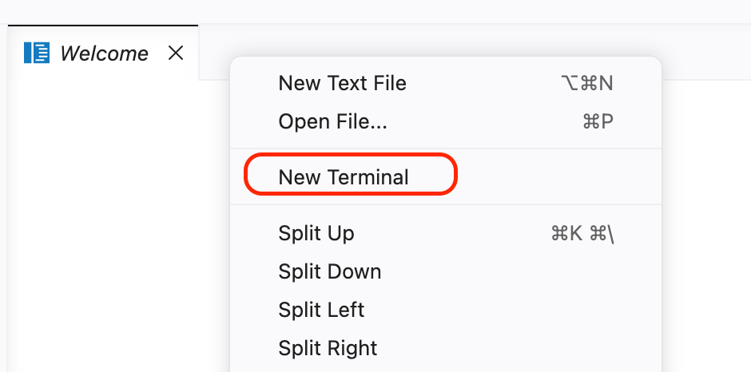
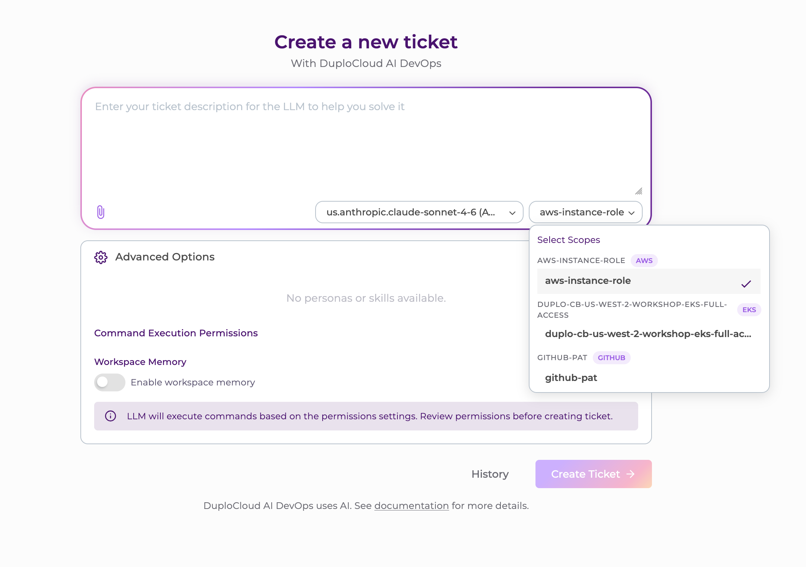

# DuploCloud DevKit Workshop

## Overview

Welcome to the DuploCloud DevKit Workshop. This guide walks you through your pre-provisioned workshop environment — from first login all the way through building, deploying, and iterating on DuploCloud extensions across two different real-world patterns.

By the end of this workshop you will have:

- Connected to a cloud-hosted Code Server environment running on AWS
- Launched Claude Code via DevKit and verified DuploCloud is operational
- Built and deployed a **SOC 2 Posture** extension using an AI-assisted workflow
- Run a posture assessment against your cloud environment
- Remediated security findings via CLI commands and Terraform pull requests
- Iteratively extended the SOC 2 Posture extension to add new capability
- Built a second extension — **Ephemeral Environments** — using the extension wizard, starting from a pre-scaffolded base
- Provisioned independent application stacks into Kubernetes from different GitHub branches, each accessible via its own DNS name
- Extended a deployed extension with a new feature (automatic expiration scheduling) using a single prompt

---

## Prerequisites

Before starting, confirm you have:

- Registered as a workshop attendee
- Received a **DuploCloud Workshops** invitation email containing your instance links and credentials

> **Note:** No local tooling is required. Everything in this workshop runs inside a cloud-hosted Code Server environment — your browser is the only client you need.

---

## Step 1: Connect to Your Workshop Instance

A workshop environment has been pre-provisioned in a DuploCloud-managed AWS account specifically for you. It includes an EC2 instance with Code Server already running, and DevKit configured to install automatically on first launch.

### Environment Permissions

The EC2 instance runs with an IAM instance role that has been scoped specifically for this workshop:

| Permission | Access |
|---|---|
| Amazon Bedrock | ✅ Full access (required for Claude Code and the AI agent) |
| AWS Read (IAM, EC2, S3, etc.) | ✅ Read-only (used by the SOC 2 Posture extension to audit your environment) |
| AWS Write | ❌ No write access via the instance role |
| Kubernetes | ✅ Scoped to your dedicated namespace only — no cluster-admin access |

> **Note:** In this workshop environment, the DuploCloud agent uses the same IAM role and permissions as the instance role — so write access is unavailable through either path. Your Kubernetes access is similarly constrained: each participant has their own dedicated namespace and cannot access other namespaces or perform cluster-level operations. In production deployments, DuploCloud supports assigning different roles and permission levels to meet your organization's requirements, allowing the agent to take actions (such as CLI-based remediations) while still routing everything through the human-in-the-loop approval flow.

### Connect

1. Open the workshop invitation email from **DuploCloud Workshops**.
2. Click **Open Your Workspace** — this takes you directly to Code Server.
3. Enter the password from the email when prompted.

> ⚠️ **Note:** The password is randomly generated for your session. Do not reuse it elsewhere.

---

## Step 2: Complete DevKit Setup

Once Code Server loads:

1. Wait a few seconds — a terminal pane will appear at the bottom of the screen showing the DevKit setup in progress.

The automated setup will:

- **Register DevKit** using the email address you used to sign up for the workshop
- Send a **license confirmation email** to that address — open it and click **Approve Request**, then return to the Code Server tab
- Automatically detect the approval and continue
- Set up **Docker** (images are pre-staged, so this is fast)
- Configure **Amazon Bedrock** via the DuploCloud account for LLM access
- Register the relevant **scopes** (AWS account and Kubernetes cluster)
- Download a pre-scaffolded SOC 2 extension from S3 to save time during the session

2. When you see **"Press any key to close terminal"**, hit any key to dismiss the pane.

> **Note:** You will see a popup in the bottom right hand corner about an application being available, disregard this as its just the DevKit environment starting up.

---

## Step 3: Explore Code Server and Claude Code

Code Server comes pre-configured with **Claude Code**, connected to Amazon Bedrock using the Claude Sonnet model. You can access it via the button in the top-right corner of the interface, or directly from a terminal.

**To launch Claude from the terminal:**

1. Right-click in the grey area of the Code Server interface and choose **New Terminal**.



2. Type `claude` and press **Enter**.
3. A first-run setup wizard appears — press **Enter** to accept the defaults at each prompt.
4. When asked about **workspace access**, choose **Trust This Folder** — this is required for Claude Code to function correctly.

You are now at the Claude prompt and ready to start building.

---

## Step 4: Verify DuploCloud is Running

Before building anything, confirm that DuploCloud and the AI agent are working as expected.

1. Return to your workshop email and click **Open DuploCloud**.
2. Copy the password from the email and paste it into the login screen.
3. Your username is the email address the workshop invitation was sent to.
4. Click **Sign In**.

Once logged in:

1. Select the **LLM Agent** (one option is available).
2. Click **Select Scopes** — you will see two pre-configured scopes:
   - **AWS Account** — access to the workshop AWS environment
   - **Kubernetes Cluster** — access to your dedicated namespace within the cluster (no cluster-admin access)

**Run a quick validation test:**

1. Click on the **AWS Instance Role** scope.
2. Enter the prompt: `Show me the S3 buckets available in this account`
3. Click **Create Ticket**.
4. DuploCloud's human-in-the-loop approval flow will prompt you to review the command — ensure **Approve** is highlighted, then click **Submit**.
5. The agent will return a list of S3 buckets in the account.

✅ This confirms DuploCloud is running and the agent can communicate with the backend LLM.

> **Note:** Your workshop environment will remain available after the session ends, so don't worry about exploring every corner of DuploCloud right now — you'll have time to come back to it.




---

## Step 5: Build and Deploy the SOC 2 Posture Extension

Return to Code Server. Claude is ready at the prompt.

DevKit includes a skill called **`duplo-extension`** which guides you through building DuploCloud extensions — either from scratch via a prompted wizard, or by working with an existing scaffolded codebase. For this workshop, the SOC 2 Posture extension has been pre-scaffolded to ensure we can complete the build within the session time. We'll use the **`duplo-extension-dev`** child skill for this next step.

### Build Steps

1. At the Claude prompt, invoke the **`duplo-extension-dev`** skill.
2. The skill will load information and may prompt to enable auto mode, do **not** allow auto mode at this point.
3. Claude will scan the extensions directory, detect the pre-scaffolded extension, and confirm what it found.
4. If prompted, indicate that you want to **build and deploy the existing SOC 2 Posture extension**. Press **Enter** to confirm — Claude is ready to proceed.
    _It may offer to run one or more of the register-* scripts. You dont need to worry about this, these have already been run to create the scopes we need for the workshop and these are idempotent._

Walk through each prompt manually for this first deployment — it's worth seeing exactly what Claude is doing at each stage as it detects DuploCloud running locally, identifies the extension, compiles it, and deploys it to your DuploCloud instance.

Watch the terminal output to follow along. The build and deployment takes a few minutes.

### Enable Auto Mode

Once the first version has successfully deployed, enable Auto Mode to allow Claude to proceed through subsequent steps without requiring manual confirmation at each one:

- Hold **Shift** and press **Tab** three times.
- **Auto Mode** will appear at the bottom of the screen.

You'll want this active before starting the iteration work in Step 8.

---

## Step 6: Run a SOC 2 Posture Assessment

Once the extension is deployed and visible in DuploCloud (this might require a hard refresh of your browser):

1. Navigate to the **SOC 2 Posture** extension inside DuploCloud.
2. Click **New Assessment**.
3. Choose **us-west-2** as the region as there are some resources deployed there that are deliberately misconfigured.
4. In the resource tag filter, specify a Tag **Name** of `Extension` and **Value** of `soc2-posture` to narrow down the results.
5. Provide a link to the GitHub repo that includes the Terraform to also be considered in remediation: `https://github.com/duplo-darren/duplo-aws-workshop-sep2-2026`
6. Select the minimum severity of findings to include.
7. Start the assessment and allow it to run to completion _(click the assessment name to open it, then click **Track Provisioning Status** to follow the agent's progress)_.

### Reading the Results

The assessment produces a findings table. Key things to note:

- **Source indicator** — a pill/badge appears on rows where the resource is managed by Terraform, indicating that any fix should also be delivered via Terraform to keep infrastructure-as-code consistent. These rows are also shaded for ease of identification.
- **Resolve button** — appears at the end of each row and triggers the remediation workflow for that finding.

---

## Step 7: Remediate Findings

This extension supports two remediation paths depending on how the resource is managed.

---

### Option A: CLI Remediation (Non-Terraform Resources)

**Example finding:** *Account-level S3 Block Public Access is not fully enabled*

1. Locate the finding in the table and click **Resolve**.
2. Select the **AWS Instance Role** scope.
3. Click **Resolve** — DuploCloud will surface the AWS CLI command needed to apply the fix, along with the affected account details.
4. Review the command. If you want to apply it directly, click **Execute Fix** — DuploCloud will use the AWS scope to run the command against the account.

> CLI remediations are surfaced for human review first. You decide whether and when to apply them.

---

### Option B: Terraform Pull Request (Terraform-Managed Resources)

**Example finding:** *Security group allows RDP port 3389 open to the world*

This flow uses a **GitHub scope** that has been pre-configured in your workshop environment — no setup required. The scope is backed by a workshop-provided token with access to the sample repository.

#### Raise a Remediation Pull Request

1. Return to the SOC 2 Posture findings.
2. Find the **RDP 3389 open to world** finding and click **Resolve**.
3. Select the pre-configured **GitHub Scope** and **AWS Instance Role**.
4. Click **Resolve** — DuploCloud opens a child ticket to generate the Terraform fix.
5. Click **Track Provision Status** to follow progress.
6. When the ticket indicates it is waiting for input, click the **back arrow** to return to the previous page — the **Provide Value** button will appear there.
7. When prompted for a value (e.g., allowed IP/CIDR range), click **Provide Value**, enter the IP with subnet mask (e.g., `8.8.8.8/32`), and click **Submit**.
7. DuploCloud reruns the remediation script with the value you provided and generates a pull request.
8. Click **View Pull Request** to inspect the diff in GitHub — confirm the change looks correct, then merge if satisfied.

> Delivering the fix via pull request keeps your infrastructure-as-code source of truth consistent. New environments provisioned from the same Terraform repository will also inherit the fix.

---

### Reviewing All Remediations

Navigate to the **Remediations** tab (top-right of the SOC 2 Posture view) to see a summary of all remediation tickets, their current status, and any items awaiting your input.

---

## Step 8: Iterate on the Extension

A core strength of DevKit is that you can iterate on an extension without starting from scratch. Claude has visibility into the extension source code and can make targeted changes, rebuild, and redeploy — all from a single prompt.

### Add the Availability Trust Services Criteria

1. Return to Code Server — Claude should still be at the prompt with Auto Mode active.
2. Enter the following:

   ```
   Extend the SOC 2 Posture extension to enable the Availability trust services criteria.
   ```

3. Claude will analyze the existing extension code, implement the required additions, rebuild the extension, and push it to DuploCloud.
4. Once complete, return to DuploCloud and open **SOC 2 Posture**.
5. Click **New Assessment** — **Availability** will now appear as an available criteria option.

You can continue iterating: add criteria one at a time to validate each addition, or enable all remaining criteria in a single pass.

---

## Step 9: Build the Ephemeral Environments Extension

Now that you've seen the full build-and-iterate cycle with the SOC 2 Posture extension, you'll build a second, different type of extension: **Ephemeral Environments**. This extension lets you specify a GitHub repository, branch, and Helm release name, and provision a complete application stack into your dedicated Kubernetes namespace on demand — making it a practical tool for feature branch testing, experimentation, and demo environments.

### Reset Your Session

Before starting, clear Claude's context from the previous extension:

1. Either open a new terminal, or at the Claude prompt type:

   ```
   /clear
   ```

This resets the conversation memory so Claude starts fresh for the new extension.

> If Auto Mode is still active from Step 8, turn it off now — you'll want to step through the wizard prompts manually first. Hold **Shift** and press **Tab** three times until **Manual Mode** appears at the bottom of the screen.

---

### Use the Extension Wizard

This time you'll use the **`duplo-extension`** skill directly (not the `-dev` child skill) so you can see what the wizard experience looks like when starting from scratch. The extension is pre-scaffolded in the extensions folder, so the build itself will be fast — but walking through the wizard gives you a feel for how you'd approach a net-new extension in your own environment.

1. At the Claude prompt, invoke the **`duplo-extension`** skill:

   ```
   /duplo-extension
   ```

2. When prompted for a **target platform**, select **Local DevKit** and press **Enter**.

3. The wizard will display a **sample markdown template** showing the structure you'd use to describe a net-new extension from scratch:

   ```
   ## What you want to build
   A Jenkins Job resource – trigger a Jenkins build from DuploCloud and track its outcome.

   ## Inputs (what the user fills in when creating one)
   - job name (required)
   - branch (default: main)
   - build parameters (optional, key-value)

   ## What should happen (what provisioning does with the inputs)
   Call Jenkins to start the build, poll until it finishes, capture the build number and result.

   ## Result to show
   - build number
   - status (SUCCESS / FAILED)
   - duration
   - link to the console log
   ```

   In your own projects, you'd copy this structure and adapt it to describe whatever you want to build. For this workshop, you'll bypass the template and point Claude directly at the pre-scaffolded extension instead.

4. When prompted for a template or description of what to build, enter:

   ```
   Build the extension currently located in the extensions folder called ephemeral-environments.
   ```

   Claude will scan the extensions directory, identify the pre-scaffolded extension, and confirm what it found — similar to the SOC 2 flow.

5. If prompted for a **verification method** — whether the agent should run its own test validations or whether you'll verify manually in the UI — choose **verify in the UI yourself**.

6. Claude will produce a build plan summarizing what it intends to do. When prompted to proceed, confirm and then **enable Auto Mode** so Claude can build and deploy without pausing at each step:

   - Hold **Shift** and press **Tab** three times until **Auto Mode** appears at the bottom of the screen.

7. Wait for Claude to confirm the extension has been successfully deployed, then do a hard refresh of your DuploCloud browser tab.

---

### Navigate to the Extension

The Ephemeral Environments extension is registered under the **DevOps** section of the left-hand navigation menu. In DuploCloud, the placement of an extension in the navigation is defined at build time — for this extension, it lives under **DevOps** because it centres on deployment and environment lifecycle workflows.

1. In DuploCloud, expand **DevOps** in the left-hand navigation.
2. Click **Ephemeral Environments**.

---

## Step 10: Provision Ephemeral Environments

With the extension deployed, you'll create two environments from the same application repository — one from the `main` branch and one from a `dark-mode` feature branch — to demonstrate how the same codebase can be deployed independently for testing or experimentation.

The sample application consists of a frontend, a catalogue backend, an inventory backend, and a Postgres database. Note that the database does not persist between sessions in this workshop environment — it is fully ephemeral by design.

---

### Create the First Environment (Main Branch)

1. Click **Create Ephemeral Environment** in the top-right corner of the extension view.
2. Fill in the fields as follows:

   | Field | Value |
   |---|---|
   | Name | `e-comm` |
   | GitHub Repo URL | *(leave as pre-filled)* |
   | Chart Path | *(leave as pre-filled)* |
   | Git Ref | `main` |
   | Helm Release Name | `e-comm` |
   | Kubernetes Scope | *(leave as pre-filled)* |
   | Namespace | *(leave blank — defaults to your scoped namespace)* |
   | Image Tag Overrides | *(leave empty)* |

3. Click **Provision**.
4. On the next screen, click the environment name to open it, then click **Track Provisioning Status** to follow the agent's progress as it clones the repository and deploys via Helm.

Once provisioning completes, the extension displays a deployment summary including:

- An **AWS-generated ALB address** for immediate access
- A **friendly DNS name** in the format `release-name-namespace.workshops.duplocloud.net`, created automatically via ExternalDNS and AWS Certificate Manager

> **Note:** It takes a few minutes for the DNS name to become publicly resolvable after provisioning completes. Proceed to create the second environment while you wait.

---

### Create the Second Environment (Feature Branch)

1. Click **Back** to return to the Ephemeral Environments list.
2. Click **Create Ephemeral Environment** again.
3. Fill in the fields as follows:

   | Field | Value |
   |---|---|
   | Name | `dark-mode` |
   | Chart Path | *(leave as pre-filled)* |
   | Git Ref | `dark-mode` |
   | Helm Release Name | `dark-mode` |
   | Kubernetes Scope | *(leave as pre-filled)* |
   | Namespace | *(leave blank)* |

4. Click **Provision** and track provisioning status as before.

Once both environments are running, you'll have two fully independent deployments of the same application — one with the standard light theme, one with the dark mode theme — each accessible via its own DNS name.

---

### Deprovision an Environment

When you're done with an environment, tear it down in either of two ways:

- Click the environment name to open it, then click **Deprovision Now** on the right-hand side, or
- Click the **three-dot menu** next to the environment name in the list and select **Deprovision Now**.

---

## Step 11: Add an Expiration Date Feature

A persistent ephemeral environment that someone forgets to deprovision will continue accruing cost. To address this, you'll extend the extension with an automatic expiration capability — demonstrating how DevKit lets you add new features to a deployed extension with a single prompt.

1. Return to Code Server — Claude should still be at the prompt with Auto Mode active.
2. Enter the following prompt:

   ```
   Modify the extension for ephemeral environments to add an expiration date and time where the environment will be torn down automatically.
   ```

3. Claude will analyse the existing extension code, implement the expiration logic, rebuild the extension, and redeploy it to DuploCloud — all without further prompts unless it needs clarification.

4. Once the build completes, return to DuploCloud, refresh the **Ephemeral Environments** view, and click **Create Ephemeral Environment**.

5. An **expiration date and time** field will now appear in the creation form, allowing you to schedule automatic teardown at provisioning time.

> **Note:** Expiration firing may require a reload of the DevKit environment in this workshop context. In a production deployment this behaviour is fully reliable — the workshop environment is intentionally constrained to keep scope focused.

---

## What's Next?

Your workshop environment stays available after the session. Here are some directions worth exploring:

**SOC 2 Posture**
- Run a full assessment with all five trust service criteria enabled
- Work through the remaining findings and exercise both remediation paths — CLI and Terraform PR — on different resource types
- Try modifying the extension itself: add a new check, adjust severity thresholds, or change how findings are grouped in the output

**Ephemeral Environments**
- Provision additional environments from different branches or forks of the sample repo
- Extend the extension further — for example, add a Slack notification on provisioning and expiry, surface estimated cost for a running environment, or add a list of all Kubernetes resources created per environment
- Build an equivalent extension targeting a different Helm chart or a different deployment pattern entirely

**Building from Scratch**
- Use the `duplo-extension` wizard with a blank template to spec and build a net-new extension — the Jenkins example in the wizard is a good starting point, or bring your own integration idea
- Try the `-dev` child skill on a pre-existing codebase you own to see how Claude handles unfamiliar extension code

**Platform Exploration**
- Explore the Kubernetes scope: run queries against cluster resources, inspect your namespace, and see how the agent handles Kubernetes context
- Review the DuploCloud admin interface — workspace configuration, scope management, and provider settings are all accessible and worth understanding before taking DevKit into a production environment

---

## Support

If you run into any issues during the workshop, flag a facilitator or reach out via the workshop support channel.

---

*Workshop content provided by DuploCloud.*
